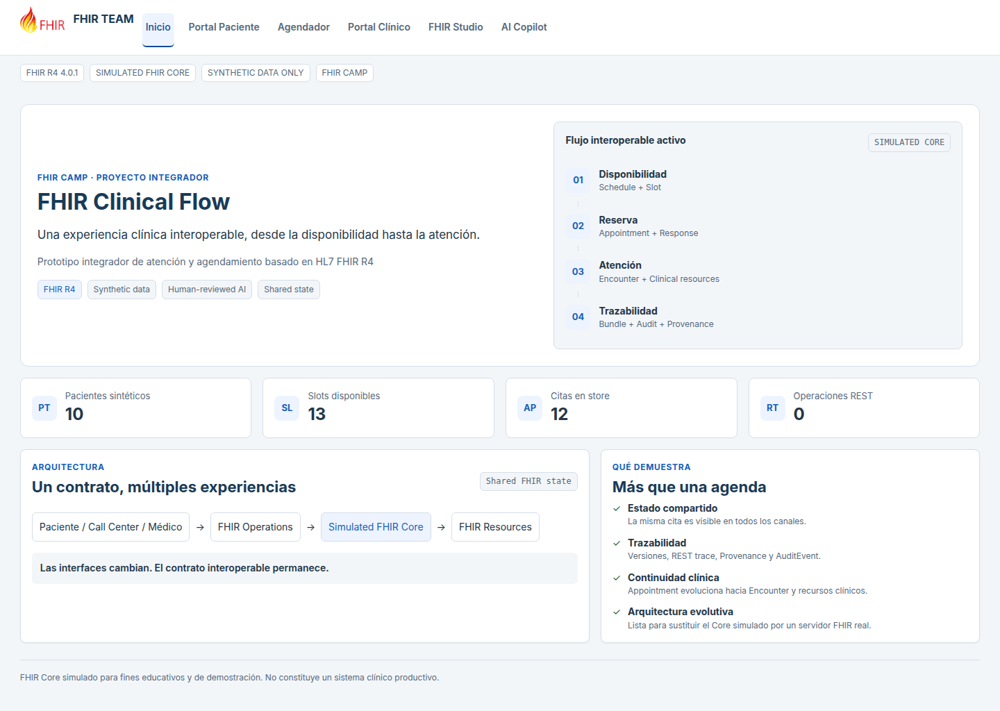
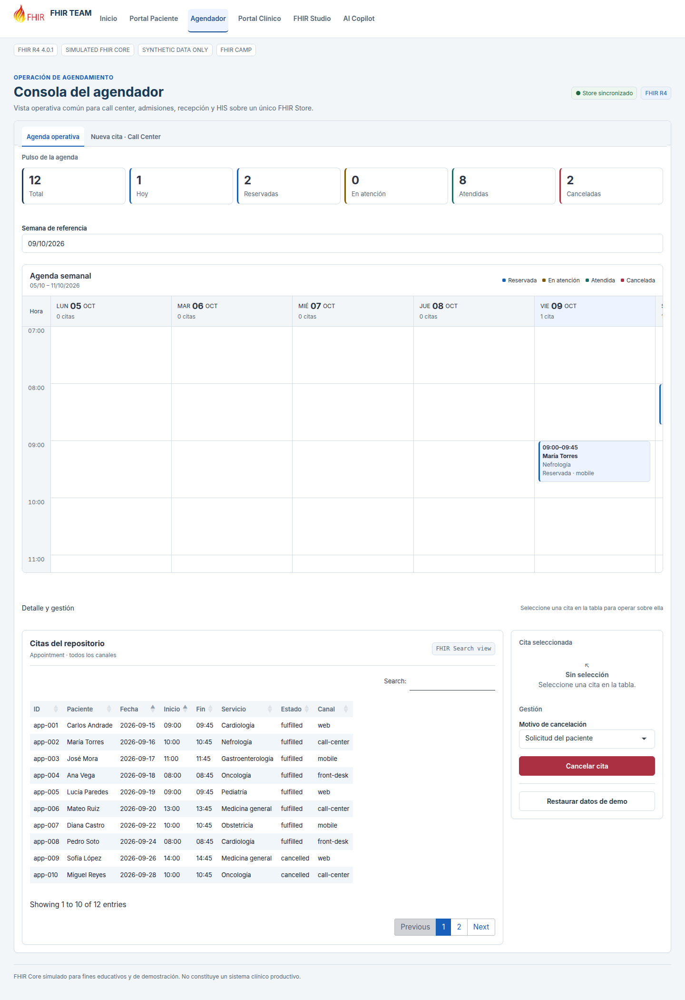

# Agenda FHIR — Prototipo en R/Shiny

**FHIR TEAM · FHIR Clinical Flow**

Prototipo educativo que conecta la reserva de citas, la gestión de agendas y el registro de una atención clínica utilizando recursos **HL7 FHIR R4 (4.0.1)** y un repositorio simulado en memoria.

El paciente, el agendador y el profesional consultan el mismo estado dentro de una sesión de la aplicación. La información puede inspeccionarse como JSON, referencias entre recursos, transacciones e historial.



> Usa exclusivamente datos sintéticos. Es una demostración técnica; no es un sistema para atención clínica real ni un servidor FHIR productivo.

## Qué permite hacer

| Módulo | Función |
|---|---|
| Portal Paciente | Consultar disponibilidad según sede, servicio y profesional, y reservar una cita. |
| Agendador | Ver agenda semanal, buscar citas, consultar su detalle, crear reservas desde call center y cancelar citas. |
| Portal Clínico | Iniciar un Encounter, registrar presión arterial, problema clínico, solicitud y plan; revisar y procesar un Bundle. |
| FHIR Studio | Explorar recursos, JSON, grafo, transacciones, validación local, versiones, REST Trace y auditoría. |
| AI Copilot | Mostrar resúmenes locales y propuestas estructuradas de demostración, con conexión opcional a Gemini para resúmenes. |

## Flujo de la demostración

1. **Disponibilidad:** Schedule describe la agenda y Slot los intervalos libres.
2. **Reserva:** se crea Appointment junto con AppointmentResponse y se marca el Slot como ocupado.
3. **Atención:** se crea Encounter vinculado a la cita.
4. **Registro clínico:** se preparan Observation, Condition, ServiceRequest y CarePlan, según los campos completados.
5. **Transacción:** un Bundle reúne los cambios para su procesamiento por el Core simulado.
6. **Trazabilidad:** se conservan versiones, Provenance, AuditEvent y registros de operaciones simuladas.

El calendario es una representación de los recursos; no constituye otra base de datos.



## Ejecutar localmente

Requiere **R >= 4.3**. El proyecto fue verificado con R 4.5.2. Git es opcional si descarga el repositorio como ZIP.

```bash
git clone https://github.com/f-slg/agenda-fhir-r.git
cd agenda-fhir-r
Rscript scripts/00_install_packages.R
Rscript scripts/01_preflight.R
Rscript scripts/02_run_app.R
```

El instalador requiere acceso a CRAN. La aplicación se abre en `http://127.0.0.1:3838`.

También puede abrir `fhir-clinical-flow.Rproj` en RStudio y pulsar **Run App**, después de instalar los paquetes. Al cambiar archivos de interfaz, detenga y vuelva a iniciar la aplicación.

Paquetes principales: `shiny`, `bslib`, `jsonlite`, `htmltools` y `DT`. `visNetwork` permite el grafo interactivo; hay una vista textual alternativa. `testthat` se utiliza para pruebas y `httr2` para la integración opcional con Gemini. No es necesario configurar `renv`.

## Recorrido sugerido

1. En Portal Paciente, seleccionar Carlos Andrade, Sede Sur y Cardiología; elegir un horario libre.
2. Reservar y buscar la misma cita en Agendador dentro de esa sesión.
3. Inspeccionar Appointment y las operaciones registradas en FHIR Studio.
4. En Portal Clínico, seleccionar una cita reservada e iniciar la atención.
5. Completar los campos, preparar el Bundle y procesar la transacción.
6. Consultar la historia longitudinal y la auditoría. Para demostrar cancelación, utilizar otra cita.

El seed contiene fechas fijas de septiembre y octubre de 2026. Use el selector de semana para localizar las citas de ejemplo. Al iniciar una sesión nueva o restaurar los datos de demo, se recupera el estado inicial.

## Arquitectura y alcance

La interfaz usa R/Shiny, bslib, Bootstrap 5, HTML y CSS. El FHIR Core está implementado localmente en R; simula recursos, búsquedas, validaciones, transacciones y trazabilidad.

- Cada sesión de Shiny tiene su propio Store en memoria. No existe sincronización de datos entre navegadores o usuarios independientes.
- No hay persistencia clínica, autenticación clínica, autorización por roles ni servidor FHIR externo configurado.
- REST Trace registra operaciones simuladas; no demuestra por sí mismo intercambio con otro sistema.
- La validación implementada no equivale a una certificación completa de conformidad FHIR.
- La presión arterial es el signo vital editable del flujo actual; otros signos se muestran desde Observation si existen.
- Al iniciar la atención, la regla actual marca Appointment como fulfilled mientras Encounter pasa a in-progress. Los KPI de citas deben interpretarse con esa limitación.

Los [hallazgos y limitaciones conocidos](docs/ISSUES_PREEXISTENTES.md) están documentados por separado.

## AI Copilot

Funciona sin claves ni servicios externos: el resumen local cuenta recursos del paciente y la extracción de demostración reconoce patrones limitados, como presión arterial y la palabra “cefalea”.

La conexión opcional a Gemini requiere `GEMINI_API_KEY` y `httr2`; en ese modo se envía contexto sintético para solicitar un resumen. Las propuestas no se guardan automáticamente. No incluya claves en el repositorio ni utilice datos personales reales en esta demo.

## Pruebas

```bash
Rscript scripts/01_preflight.R
Rscript scripts/03_tests.R
```

Incluyen reserva y cancelación, liberación de Slot, búsquedas entre módulos, transacción clínica, geometría de agenda y carga de recursos de interfaz.

Los scripts `04_visual_qa.cjs`, `06_interaction_qa.cjs` y `07_startup_qa.cjs` son herramientas opcionales de desarrollo con Playwright; no son dependencias de ejecución de la aplicación. Consulte la [matriz QA](docs/QA_RESPONSIVE.md).

## Estructura

```text
app.R        Entrada de la aplicación
R/           Core simulado, recursos, reglas, seed y composición de la app
modules/     Portales y herramientas de inspección
www/         Estilos, JavaScript y logo
data/seed/   Datos sintéticos de referencia
scripts/     Instalación, arranque y verificaciones
tests/       Pruebas de regresión
docs/        Arquitectura, decisiones, guiones y evidencias
```

## Documentación

- [Arquitectura](docs/architecture.md)
- [Modelo FHIR](docs/fhir-model.md)
- [Decisiones de modelado](docs/fhir-decisions.md)
- [Guion de demostración](docs/demo-script.md)
- [Interfaz y diseño responsive](docs/RESPONSIVE_UI.md)
- [Limitaciones conocidas](docs/ISSUES_PREEXISTENTES.md)

## Equipo y contribuciones

Proyecto de **FHIR TEAM** para compartir aprendizaje sobre agendas clínicas, modelado FHIR y prototipado en R/Shiny. Se pueden proponer mejoras mediante Issues o Pull Requests, utilizando únicamente ejemplos sintéticos.

El logo HL7 FHIR se utiliza como referencia al estándar; el proyecto no implica afiliación ni aval oficial de HL7.
